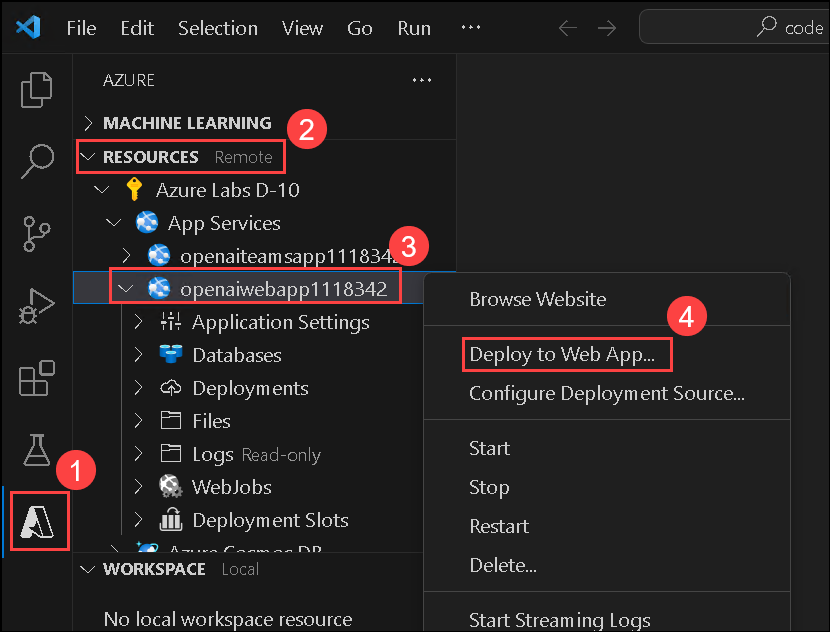

## Exercise 2. Deploying the model using Flask framework locally and on Azure App Service. Setting up Email Automation Workflow on Azure Logic.

In this exercise, you will deploy the model using the Flask framework locally and also from the Azure app service. 

### Task 1: Deploy the model by running the Flask wrapper locally

    
1. Navigate to **Microsoft Azure Machine Learning Studio** and click on **Open Terminal**.

   
   
1. Navigate to the required path by running the below-given command on the Terminal page:

    ```
    cd artifacts/openai-model
    ```
1. Run the below-mentioned command to run the Flask wrapper and copy the generated local host URL:

   ```
   flask run
   ```
   

   > **Note**: Don't hit **Ctrl + c**.
   
### Task 2: Test the locally-deployed API with specified request/response formats

1. Navigate to the **notebooks** folder, select **flask-app-local-test.ipynb (1)** file and select the kernal as **Python 3.8-AzureML (2)**.

    
    
1. Run each cell one after the other and observe the output. 

   
    
### Task 3: Deploy the model on Azure App Service

1. From **Microsoft Azure Machine Learning Studio**, click on **Compute (1)**, click on **... (2)** button and select **VS Code (Desktop) PREVIEW (2)** next to **mlmodelcompute<inject key="DeploymentID" enableCopy="false"/>** Compute Instance.

    

     > **Note:** If the **VS Code** doesn't open. Open the VS Code from the desktop, and re-perform **Step 1**.

1. On **IMPORTANT NOTE : Always use trusted code** pop up check the box next to **Yes, I understand (1)** and click on **Continue (2)**.

    

1. Click on **Open** on the pop-up.

    

   > **Note:** If the VScode doesn't open, try launching the VScode from the desktop, go back to the browser and hit refresh.  

3. On Visual Studio Code pop up click on **Install and Open**.

    
    
1. Click on **Sign In**, to login into Azure Portal from Visual Studio Code.

    
    
1. On the **Sign into Microsoft Azure** tab, you will see the login screen, enter the following username, and, then click on **Next**.

   * Email/Username: <inject key="AzureAdUserEmail"></inject>

   

3. Now enter the following password and click on **Sign in**. 

   * Password: <inject key="AzureAdUserPassword"></inject>

   
   

1. On the **Do you trust the authors of the file of this folder** tab, click on **Yes, I trust the authors**.

    

1. Click on **Extensions (1)** and search for **App service (2)** then select it **(3)**.

    
    
1. Click on **Install** to install the App service extension.

    
    
3. Select **Azure (1)** from the left-menu, expand **Resources (2)** from Azure extension and right-click on **openaiwebapp<inject key="DeploymentID" enableCopy="false"/> (3)** then click on **Deploy to Web App (4)**.

    
    
4. Click on **Browse**.

    

5. Navigate to the path **/home/azureuser/cloudfiles/code/Users/odl_user_<inject key="DeploymentID" enableCopy="false"/>/artifacts/openai-model (1)** and click on **Ok (2)**.

    
    
6. On Visual Studio Code pop up click on **Yes**

    
    
7. On the pop up **Are you sure you want to deploy to "openaiwebapp<inject key="DeploymentID" enableCopy="false"/>"?** click on **Deploy**.

    
   
8. Make sure that the deployment is completed on the web app. Also, click on **Don't show again** on the pop-up of setting up the **Always deploy the workspace** as it can cause issues in further exercises. 
   
   
   
   > **Note:** Wait for 10-15 minutes until the deployment is completed.
   
   > **Note:** If you encounter a deployment failure with error: (intermediate value).parsedBody.map is not a function you can ignore it and continue with the next task. 
   
### Task 4: Test the cloud-deployed API with specified request/response formats

1. Navigate to the **notebooks** folder, select **flask-app-service-test.ipynb (1)** file and select the kernal as **Python 3.8-AzureML (2)**.

   
    
1. Update the **SUFFIX** with the value **<inject key="DeploymentID" enableCopy="false"/>** value in the prefix variable section and run each cell one after the other and observe the output. 

   

 ## Summary

* In this exercise, you have deployed the model using the Flask framework locally and from the Azure app service. 

